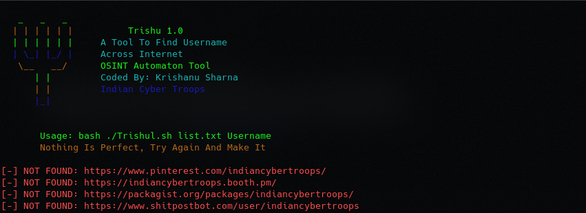

# Trishul
Trishul An OSINT Tool To Find Username Across Internet Written In Bash(Shell)
Easy To Use In Termux And Kali linux And Various OS Till Now Tested In Many OS And Success Rate Is Around 95-99% 
Thanks For Using Indian Cyber Troops Tools 
Designed By : K. Sharma
 <p>
 <a href="https://www.youtube.com/c/indiancybertroops">
    
  </a>
    <a href="https://instagram.com/indiancybertroops">
    
  </a>
     <a href="https://t.me/indiancybertroops">
    
  </a>

</p>
   
   


### Team Indian Cyber Troops:
>Created By : Krishanu Sharma 

# Features:
>Easy to Install

>Easy to Use

>Designed In Bash(shell scripting)

>Easy To Execue

>Fastest (Based On Internet Speed)

>Low Bandwith/Data Consume

>TO Find Username Across Internet
# Main Trishul Image

# Installation :
> clone via git clone

```
git clone https://github.com/indiancybertroops/Trishul
```
```
cd Trishul
```
```
chmod +777 *
```
```
bash Trishul.sh list.txt YourUsername
```


# Github Status
[](https://github.com/indiancybertroops "Stats")<br>

## Contact Us: 


>Instagram
https://instagram.com/krishanuIND


>Twitter
https://twitter.com/krishanuIND


>Github
https://github.com/indiancybertroops

## WARNING : 
***This tool is only for educational purpose. If you use this tool for other purposes except education we will not be responsible in such cases. We Are Not Responsible For Damage Caused By Tool***

